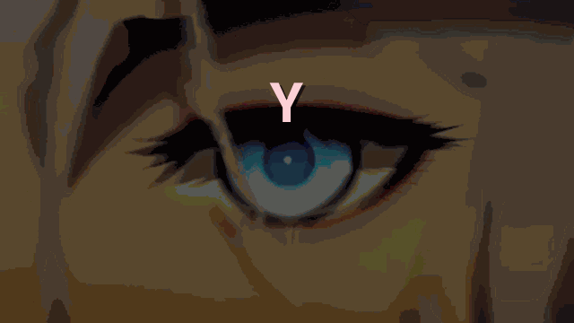

  

# 🌸 丂卂Ҡ凵尺卂 尺乇尸口

Добро пожаловать в **丂卂Ҡ凵尺卂 尺乇尸口** — ультимативный хаб всех моих разработок! ✨  
Здесь собраны самые мощные и элегантные инструменты: от парсеров и загрузчиков аниме до Reverse Engineering проектов и полезных скриптов.

---

## 📂 Мои направления (Стек)

Ниже представлены основные сферы разработки, в которых я развиваюсь и создаю софт.

| Категория | Описание | Основные технологии |
|:---|:---|:---|
| 📥 **dl** | Парсеры, краулеры и загрузчики контента. Умные боты для обхода защит (DDoS-Guard, Cloudflare) и скачивания видео/файлов. | `Python`, `Playwright`, `yt-dlp` |
| 🎮 **games** | Reverse Engineering игр, создание модов, распаковщики ресурсов, русификаторы и инъекторы. | `C++`, `Python`, `x64dbg` |
| 🛠️ **tools** | Повседневные скрипты, автоматизация рутины, системные твики и утилиты для ПК. | `Bash`, `PowerShell`, `Python` |
| 🌐 **web** | Разработка сайтов, фронтенд, API, боты для Telegram и Discord. | `React`, `Node.js`, `Aiogram` |

---

## 🌟 Featured Projects (Лучшие проекты)

  <table>
    <tr>
      <td align="center" width="50%">
        
      </td>
      <td align="center" width="50%">
        
      </td>
    </tr>
  </table>

---

## 💖 Поддержка и Контакты

Если вам нравятся мои проекты, вы можете поддержать меня, подписавшись на мой GitHub и поставив ⭐ звездочку этому репозиторию!

  
  

  

